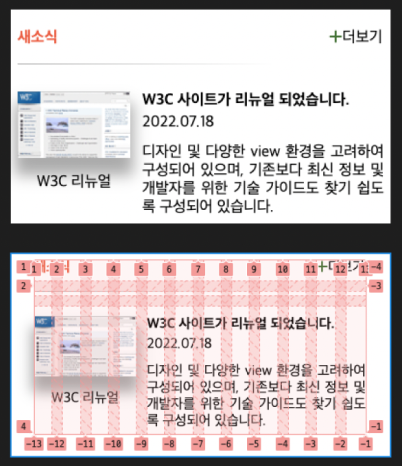

# Mission-04
그리드 완성



## Markup & CSS
0. section(전체 틀) : `.news` 전체 틀로 섹션의 너비와 높이, 그리드를 지정함.
1. header(타이틀) : `.news-title` 새소식, `.news-plus` 더보기 아이콘과 링크로 구성.
2. line(구분선) : 타이틀 밑의 구분선은 백그라운드 그라디언트 속성을 사용하여 구성함.
3-1. figure(이미지) : `.news-w3c` 피규어 안에 `img`, `figcaption`으로 구성함.
3-2. ul>li(텍스트 영역) : `.news-contents` h3, time, p 태그를 사용하여 텍스트 배치.

## Grid
그리드는 12columes으로 위에서부터 아래로
1. header
2. line
3. img+text 영역으로 배치된다

```
grid-template-areas:
    "title title . . . . . . . . plus plus"
    "line line line line line line line line line line line line"
    "img img img img contents contents contents contents contents contents contents contents";
```