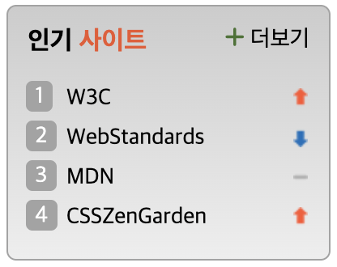

# Mission-05
스프라이트 완성

## Rank Number
1. span 태그에 data-tooltip 속성을 주고,
    css에서 가상요소 ::after 선택 후 attr 함수를 사용하여 data-tooltip 스타일을 조정했습니다.

## Sprite
1. 랭크 상승, 하락, 변동 없음 등의 화살표 스프라이트 이미지를
    background-position으로 위치를 조절해 배치하였습니다.